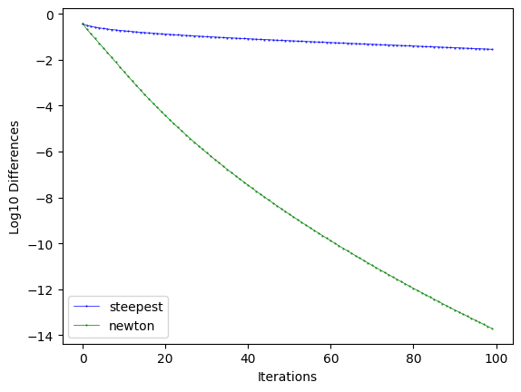
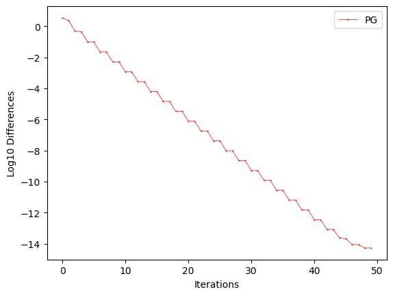
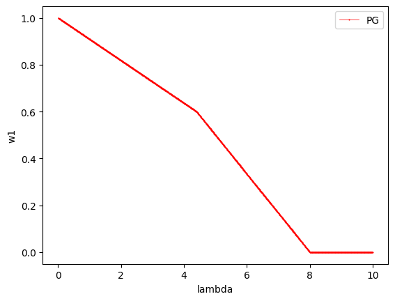
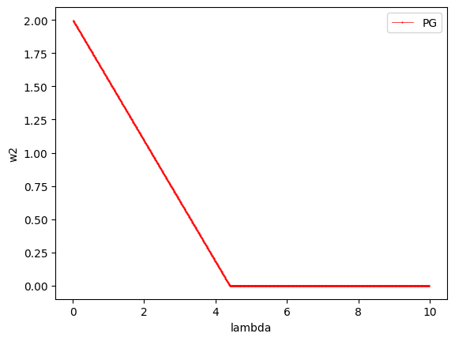
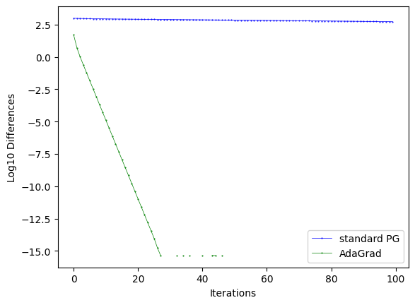

# 
**Midterm report of ART.T458 Advanced Machine Learning
**
# 
**Name:** Zheng Zhongmin

**Student ID:** 22M38145

## **Problem 1:**
### **1.**
$$
\begin{aligned}
\frac{\partial^2J(\pmb{w})}{\partial\pmb{w}^2}&=
\frac{\partial(\sum^n_{i=1}\frac{\exp(-y_i\pmb{w^\top x_i})(-y_i\pmb{x_i})}{1+\exp(-y_i\pmb{w^\top x_i})}+2\lambda\pmb{w})}{\partial\pmb{w}}\\
&=\sum^n_{i=1}\frac{\exp(-y_i\pmb{w^\top x_i})(\pmb{x_ix_i^\top})}{(1+\exp(-y_i\pmb{w^\top x_i}))^2}+2\lambda\pmb{I}
\end{aligned}
$$
with $p_i=p(y_i|x_i)=(1+\exp(-y_i\pmb{w^\top x_i}))^{-1}$, we can rewrite it as:
$$
\nabla^2J(\pmb{w})=\sum^n_{i=1}(p_i(1-p_i)\pmb{x_ix_i^{\top}})+2\lambda\pmb{I}
$$
### **2.**

## **Problem 2:**
### **1.**
with $\lambda=1$, result $\log_{10}|J(\pmb{w}^{(t)})-J(\pmb{w}^*)|$ is as below:  
  
  
when $\lambda$ changes as $0.01,0.02......9.99,10$, values of $w_1$ and $w_2$ are respectively varies as below:

### **2.**
In both cases, $\lambda=1$, $\eta_t=L^{-1},and $L$ is the maximum eigenvalue of $A$.

## **Problem 10:**
By Taylor expansion, we have:
$$
f(\pmb{x_2})\leq f(\pmb{x_1})+\nabla f(\pmb{x_1})(\pmb{x_2}-\pmb{x_1})+\frac{\nabla^2f(\pmb{x_1})}{2}||\pmb{x_2}-\pmb{x_1}||^2_2+O((\pmb{x_2}-\pmb{x_1})^3)\tag{1}
$$
and: 
$$\nabla^2f(\pmb{x})=\lim_{||\pmb{y}-\pmb{x}||_2\rightarrow0}\frac{||f(\pmb{y})-f(\pmb{x})||_2}{||\pmb{y}-\pmb{x}||_2}$$
Since $f$ is $\beta$ smooth function, we have:
$$
\nabla^2f(\pmb{x})=\lim_{||\pmb{y}-\pmb{x}||_2\rightarrow0}\frac{||f(\pmb{y})-f(\pmb{x})||_2}{||\pmb{y}-\pmb{x}||_2}\leq\beta\tag{2}
$$
Replace $\nabla^2f(\pmb{x_1})$ with (2) into (1), we have:
$$
f(\pmb{x_2})\leq f(\pmb{x_1})+\nabla f(\pmb{x_1})(\pmb{x_2}-\pmb{x_1})+\frac{\beta}{2}||\pmb{x_2}-\pmb{x_1}||^2_2
$$
which finish the proof.

## **Problem 3:**
### **1.**
By slack variable $\pmb{\xi}$, constrained optimization of the original optimization problem can be reformulated as:
$$
\begin{aligned}
\mathop{minimize}\limits_{\pmb{\omega},\pmb{\xi}}&\quad\lambda\pmb{w^{\top}w}+\pmb{1^{\top}\xi}\\
subject\,\,to&\quad\xi_i\geq1-y_i\pmb{w^{\top}x_i},i=1,...,n\\
&\quad\pmb{\xi}\geq0
\end{aligned}
$$
Corresponding Lagrangian function is:
$$
L(\pmb{w,\xi,\alpha,\beta})=\lambda\pmb{w^{\top}w}+\pmb{1^{\top}\xi}+\sum_i^n\alpha_i(1-y_i\pmb{w^{\top}x_i-\xi_i})-\pmb{\beta^{\top}\xi}
$$
From KKT condition, we know that:
$$
\begin{aligned}
&\frac{\partial L}{\partial \pmb{w}}=0\Rightarrow\hat{\pmb{w}}=\frac{1}{2\lambda}\sum_i^n\hat{\alpha_i}y_i\pmb{x_i}\\
&\frac{\partial L}{\partial\pmb{\xi}}=0\Rightarrow\hat{\alpha_i}+\hat{\beta_i}=1\\
&\hat{\alpha_i}\geq0\\
&\hat{\beta_i}\geq0\\
&\hat{\alpha_i}(1-\hat{\xi_i}-y_i\pmb{\hat{w}x_i})=0\\
&\hat{\beta_i}\hat{\xi_i}=0, \quad\quad\quad\forall i\in\mathbb{R}^n
\end{aligned}
$$
Since we know the dual function is:
$$
\begin{aligned}
\mathop{maximize}\limits_{\alpha,\beta}&\quad\inf L(\pmb{\hat{w},\hat{\xi},\alpha,\beta})\\
subject\,\,to&\quad L(\pmb{\hat{w},\hat{\xi},\alpha,\beta})\leq J(\pmb{\hat{w}})
\end{aligned}
$$
where $J(\pmb{w})=\sum_i^nmax(0,1-y_i\pmb{w^{\top}x_i}+\lambda||\pmb{w}||^2_2)$  
Substitute $\pmb{\hat{w}}$ and $\pmb{\hat{\xi}}$, we have the specific dual function:
$$
\begin{aligned}
\mathop{maximize}\limits_{\alpha}&\quad-\frac{1}{4\lambda}\pmb{\alpha^{\top}K\alpha}+\pmb{\alpha^{\top}1}\\
subject\,\,to&\quad\,\,\pmb{0\leq\alpha\leq1}
\end{aligned}
$$
where $\pmb{K}_{ij}=y_iy_j\pmb{x_i^{\top}x_j}$. Proof get finished.
### **2.**
Corresponding Lagrangian function of dual problem is:
$$
L(\pmb{\alpha,w,\xi})=-\frac{1}{4\lambda}\pmb{\alpha^{\top}K\alpha}+\pmb{\alpha^{\top}1}+\pmb{w\alpha}+\pmb{\xi(1-\alpha)}
$$
Through KKT condition we know that:
$$
\frac{\partial L}{\partial\alpha}=0\Rightarrow\hat{\pmb{w}}=\frac{1}{2\lambda}\pmb{\alpha^{\top}K}
$$
substitute $\pmb{K}$, we can obtain that:
$$
\hat{\pmb{w}}=\frac{1}{2\lambda}\sum_{i=1}^n\alpha_iy_i\pmb{x_i}
$$
which finish the proof.

# *source code can be found here:* <https://github.com/Ciphfy/MidtermReportForART.T458>
